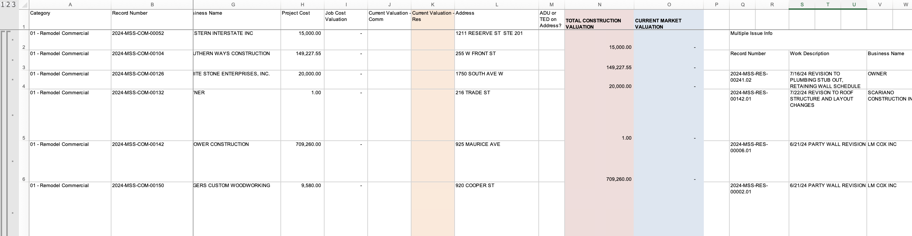

# Community Development Snapshots: Monthly Update Process

This document provides detailed instructions for updating the Community Development Snapshots dashboard with new monthly data. This process should be completed after each month's financial reports are finalized and audited.

## Understanding the Monthly Development Reports

The Community Development Snapshots dashboard visualizes data from the monthly development reports that are produced by the Finance team. These reports contain critical information about building permits, revenues, and development metrics. Here are examples of what these reports look like:

*Figure 1: The first page of the official monthly development report showing summary permit metrics, quantities and revenues.*

*Figure 2: The second page of the monthly report showing detailed breakdowns by permit type and category.*

*Figure 3: Example of a data dump extract. This is not from the monthly report itself, but represents the processed data that should maintain consistency with previous months' formats.*

The Python script processes these reports from their Excel format into datasets that power the dashboard visualizations, allowing for interactive exploration of this data over time.

## 1. Review the Audited Financial Reports

After the Finance team completes their monthly audit, carefully review the finalized Excel workbooks before processing. These reports contain critical financial data that powers the dashboard, so consistency is key. Open both the previous month's workbook and the newly audited workbook side-by-side to compare their structure.

Look particularly for any changes to sheet names, column headers, data formats, or cell locations that might affect the data extraction process. The Python script expects certain worksheets and data fields to be in specific locations. 

Pay special attention to:
- The summary table shown in Figure 1 (monthly quantities and revenue)
- The detailed permit breakdowns shown in Figure 2 (permit categories and subcategories)
- The consistency of data structure in your exports (ensure they match the format of previous data dumps as shown in Figure 3)

If you notice significant differences in structure or formatting that could impact data extraction, work with the Finance team to adjust the workbook to maintain compatibility with previous reports whenever possible.

## 2. Organize Files in the Data Directory

The Python processing script looks for Excel workbooks in the `./data` directory. How you handle file placement depends on whether you're dealing with a new fiscal year or updating an existing workbook:

*Figure 4: The expected folder structure showing where Excel workbooks should be placed in the data directory.*

### For New Fiscal Year Workbooks:

July marks the beginning of a new fiscal year, so in August (when July's data is processed), you'll be adding a completely new workbook. When this happens, simply add the new fiscal year workbook to the `./data` folder alongside previous years' workbooks. This allows the script to process data across multiple fiscal years.

For example, when adding FY26 data for the first time, you'll place the "FY25 Development Report Workbook.xlsx" file in the data folder while keeping the FY25 workbook in place.

### For Updating Existing Workbooks:

For the other 11 months of the year, you'll typically be updating an existing fiscal year workbook with new monthly data. In these cases, you have two options:
- Simply overwrite the existing workbook file with the updated version
- Delete the previous file and add the new version with the same filename

Either approach works, but overwriting is generally more straightforward.

### Critical File Naming Convention:

The script specifically looks for files named in the format `FYxx Development Report Workbook.xlsx`, where "xx" represents the two-digit fiscal year (e.g., FY23, FY24, FY25). Maintaining this exact naming pattern is essential for the script to locate and process the correct files.

## 3. Process the Data Using the Jupyter Notebook

The data transformation is handled by a Jupyter notebook that extracts, transforms, and prepares the data for visualization in the dashboard.

### Prerequisites Before Running:

Before running the script, ensure your environment has:
- Python 3.6 or newer installed on your system
- The following Python libraries installed:
  - pandas (for data manipulation)
  - numpy (for numerical operations)
  - re (regular expressions, included in standard Python)
  - collections (data structures, included in standard Python)
  - itertools (iteration functions, included in standard Python)
- All audited Excel files properly placed in the `./data` directory as described above

### Running the Processing Script:

1. Open the `processing_development_reports.ipynb` file in Jupyter Notebook, JupyterLab, or another notebook interface.

2. Take a moment to read through the notebook to understand what each section does. The notebook contains multiple cells that handle different aspects of data extraction and transformation, with comments explaining the key steps.

3. Run all cells in the notebook sequentially from top to bottom. You can use the "Run All" option or execute each cell individually by pressing Shift+Enter on each cell.

4. Watch for any error messages that might appear during execution. If errors occur, they often indicate issues with file paths, missing data, or unexpected formatting in the source files. Common issues include:
   - Changes to the structure of the permit revenue tables shown in Figure 1
   - Modifications to categories or subcategories shown in Figure 2
   - Inconsistencies in the data export formats compared to previous months (Figure 3)

5. Once the notebook completes successfully, verify that new CSV files have been generated in the `./output` directory. These files contain the processed data ready for upload to ArcGIS.

## 4. Update the ArcGIS Feature Layers

With the processed data files ready, you now need to update the feature layers in ArcGIS that power the dashboard visualizations.

1. Log in to your ArcGIS Online account using your credentials.

2. Navigate to the "Content" tab in the main navigation menu.

3. Locate the Community Development Snapshots feature layers in your content list. There should be two main layers used by the dashboard.

4. For each feature layer that needs updating:
   - Click on the layer name to access its details page
   - Look for and select the "Update Data" option
   - Choose "Replace Layer" when prompted for the update type
   - Browse to the corresponding CSV file from the `./output` directory
   - Carefully review the field mappings to ensure data columns are being correctly associated
   - Confirm and complete the upload process

This step replaces the existing data with your newly processed information while maintaining all the layer's styling, pop-up configurations, and relationships with the dashboard.

## 5. Verify the Dashboard Updates

After updating the feature layers, it's essential to verify that the dashboard is correctly displaying the new data.

1. Open the Community Development Snapshots dashboard in a web browser.

2. Check that the most recent month's data appears in all charts, graphs, and indicators.

3. Test the time-based filters to ensure that both the new month and historical trends are displaying correctly.

4. Review key metrics like monthly revenues, permit counts, and YTD totals to confirm they match the values in the original audit report. The dashboard should reflect all the important metrics shown in the monthly reports (Figures 1-2) and maintain data consistency with previous exports.

5. Try different dashboard filters and interactions to ensure all functionality works correctly with the updated dataset.

If any discrepancies or display issues are found, check whether they stem from data processing issues, incorrect workbook rollups, or dashboard configuration problems. You may need to revisit earlier steps in the process to resolve them.

By following these detailed steps each month, you'll maintain an up-to-date Community Development Snapshots dashboard that provides valuable insights into Missoula's development metrics and financial data.