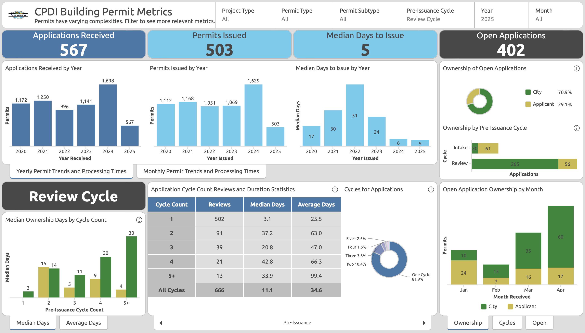
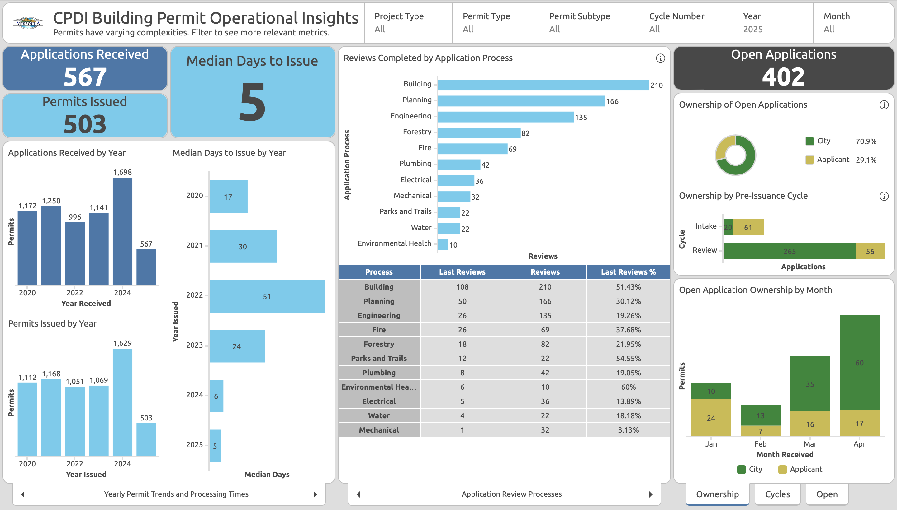
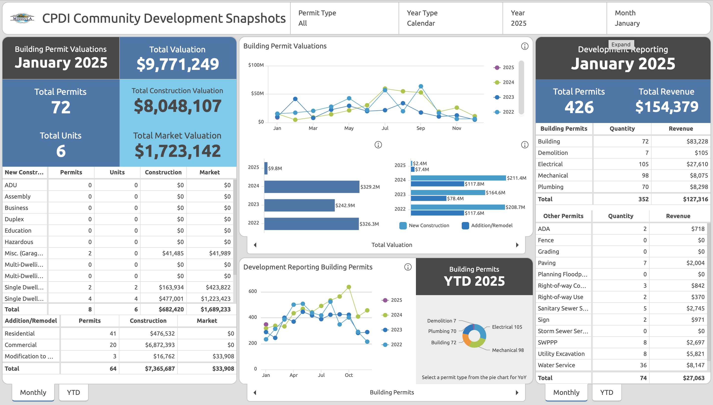
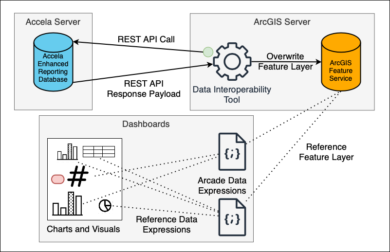
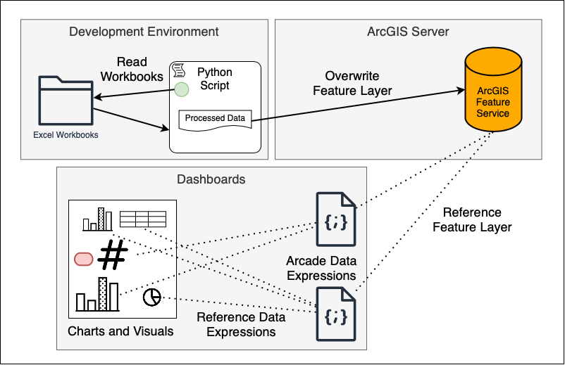

# Building Missoula: Interactive Permit & Development Data Dashboards

  
  

  <em>Project by Luke Wyman of the University of Montana in Collaboration with City of Missoula Community Planning, Development & Innovation</em>

## Project Overview
This project revolutionizes how Missoula's Community Planning, Development & Innovation (CPDI) department manages and communicates building permit data and community development metrics. By replacing manual, time-consuming reporting processes with automated data pipelines and interactive dashboards, this project seeks to transform how the city tracks, analyzes, and shares critical development information.

The solution integrates data from the department's SQL database and Excel workbooks, transforming it into comprehensive, easy-to-understand visualizations in ArcGIS dashboards. This not only saves valuable staff time but also provides the first real insights into this information, enhancing transparency and public understanding of the city's development processes.

## Repository Structure
- **[01 Building Permit Metrics](01%20Building%20Permit%20Metrics/)**: Contains notebooks and scripts related to the "Building Permit Metrics" dashboard.
- **[02 Building Permit Operational Insights](02%20Building%20Permit%20Operational%20Insights/)**: Contains notebooks and scripts related to the "Building Permit Operational Insights" dashboard.
- **[03 Community Development Snapshots](03%20Community%20Development%20Snapshots/)**: Contains notebooks and scripts related to the "Community Development Snapshots" dashboard.
- **[Deliverables](Deliverables/)**: Contains final project deliverables and documentation.
- **[Archive](Archive/)**: Contains archived materials and previous versions.
- **[Permit Data Inventory](Permit%20Data%20Inventory/)**: Contains a catalog of available permit data sources, fields, and their definitions.
- **[resources](resources/)**: Contains project resources including logos, images, and notes.
- **[three_ps_wyman.txt](three_ps_wyman.txt)**: Provides progress, problems, and plans updates on the project.

## Data Products
#### This project delivers three primary data products:

1. **Building Permit Metrics**: 
   - Completely developed and automated data pipeline, going from raw back-end SQL database tables to data sets rich for visualizations
   - Fully automated visualizations of permit processing times, volumes, and types
   - Public-facing metrics that improve overall transparency and understanding of the permitting process
   - [More Details](01%20Building%20Permit%20Metrics/building_permits_dashboard.md)

   

2. **Building Permit Operational Insights**:
   - Completely developed and automated data pipeline, going from raw back-end database tables to data sets rich for visualizations
   - Fully automated visualizations of permit processing times, volumes, and types specific to internal, CPDI teams
   - Internal-facing metrics that allow for performance benchmarking against to-be established KPIs
   - [More Details](02%20Building%20Permit%20Operational%20Insights/building_permit_operational_insights_dashboard.md)

   

3. **Community Development Snapshots**:
   - Replication of community development monthly, quarterly, and yearly snapshots of permit financials
   - Initially developed and partially automated data pipeline, going from audited fiscal year Excel reports to data sets rich for visualizations
   - Consolidated data from multiple years located in a dashboard that empowers community members to find new, longer-term insights about city development
   - [More Details](03%20Community%20Development%20Snapshots/community_development_snapshots_dashboard.md)

   

## Data Sources
- **SQL Database**: Primary source for building permit data
  - Contains permit applications, processing times, and status information
  - Updated in real-time as permits are processed
- **Excel Workbooks**: Secondary source for financial and historical data
  - Contains audited fiscal year reports
  - Updated monthly/quarterly/annually

## Technologies Used
- **Data Processing**:
  - Jupyter Notebooks
  - Python (pandas, numpy)
  - Excel
  - Azure SQL Database
- **Visualization**:
  - ArcGIS Dashboards
  - ArcGIS Arcade Expressions
- **Version Control**:
  - Git/GitHub

## Data Pipelines

This project implements automated data pipelines to transform raw data into visualization-ready datasets. Each pipeline is designed to address specific needs while maintaining data integrity and consistency.

### Building Permit Data Pipeline

The Building Permit data pipeline connects permit application data to interactive visualizations through an optimized extraction and transformation process. This pipeline serves both the Building Permit Metrics and Building Permit Operational Insights dashboards, sharing the same data source but presenting different views tailored to their respective audiences.

**How it works:**
1. **Source Data**: Permit applications submitted through the city website are stored in Accela's on-premises SQL database with hundreds of tables
2. **Query Optimization**: Optimized SQL queries (improved from 8+ hours to approximately 10 seconds runtime) extracts the data from the database
3. **Scheduled Extraction**: The Data Interoperability Tool retrieves data via REST API calls on a daily schedule
4. **Publishing**: Data is published to ArcGIS Online as a Feature Service, maintained by the CPDI team
5. **Transformation**: Arcade expressions perform calculations needed for analysis and visualization
6. **Visualization**: Dashboard components display permit metrics, with public-facing metrics in the Metrics dashboard and operational details in the Operational Insights dashboard

This approach creates a sustainable daily update cycle while maintaining system performance. The critical query optimization makes frequent refreshes viable without impacting other database operations. By using a single pipeline to serve two dashboards, the solution maximizes efficiency while providing specialized views for different stakeholders.

### Community Development Snapshots Pipeline

The Community Development Snapshots pipeline transforms audited financial reports into interactive visualizations, preserving existing workflows while enabling new analytical capabilities.

**How it works:**
1. **Source Data**: Monthly reports exported from Accela undergo manual auditing by Finance and are consolidated into Excel workbooks
2. **Manual Processing**: Python scripts extract, clean, and transform data from these workbooks into two dashboard-ready datasets
3. **Manual Publishing**: Processed data requires manual uploading to ArcGIS Server to update the feature layer
4. **Transformation**: Arcade expressions calculate derived metrics (e.g., year-to-date totals, fiscal vs. calendar year aggregations)
5. **Visualization**: Dashboard components present consolidated financial and development data
6. **Verification**: CPDI team must manually verify dashboard data against original monthly reports for accuracy

This semi-automated approach preserves the Finance team's established auditing workflow while making historical data more accessible. Limitations include the continued reliance on manual Excel processing and verification steps, which could be candidates for further automation. Future iterations could explore direct Accela integration similar to the Building Permits pipeline.

## Conclusion

My capstone project focused on creating three dashboards that have fundamentally changed how Missoula's CPDI department handles building permit data. I've built a solution that combines SQL optimization, data pipelines, and visualization to solve real problems that the department faced daily.

### Benefits for City of Missoula CPDI

- **More Time for Actual Work**: Staff now spend way less time making reports and more time processing permits
- **Better Planning**: The team can see when application surges are coming and plan accordingly
- **Real Performance Tracking**: For the first time, they can track and measure KPIs like review times and backlog
- **Walking the Talk on Transparency**: By putting their metrics online, the city shows they're serious about accountability

### Benefits for the Community

- **No More Guessing**: Contractors and homeowners can see exactly what's happening with permits across the city
- **Better Project Planning**: Builders can actually predict review timelines based on real data
- **Fewer Frustrating Calls**: When people can see status online, they don't need to call and ask what's happening
- **Community Involvement**: Residents can see development patterns in their neighborhoods and participate more meaningfully in planning discussions

I've made sure the system can grow and adapt over time. The modular design will let the CPDI team make improvements and possibly expand the approach to other city departments as needs evolve.

## Acknowledgements

This project would not have been possible without the support and collaboration of:

- City of Missoula Community Planning, Development & Innovation Department
- University of Montana College of Business faculty and advisors
- The GIS and data teams who provided technical expertise and access to the data

I'm especially grateful to the CPDI staff who sat through countless meetings with me, tested early versions, and gave the honest feedback that made these dashboards actually useful in the real world.